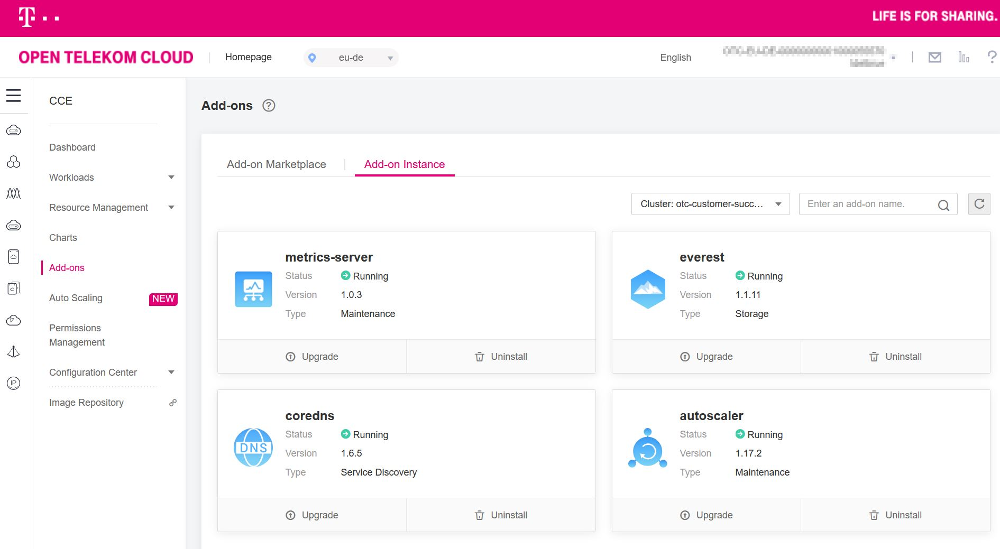
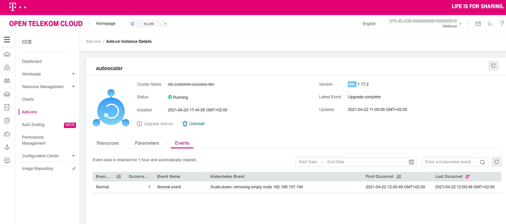

## CCE Autoscaling How-To

This How-To expects that you have Terraform set-up successfully with a non-local state and kubectl connected with a
Kubernetes Cluster.

In this example we begin with a CCE instance with one default node pool that has 2 nodes.

#### Create Autoscaling Node pool with Terraform

```hcl-terraform
resource "opentelekomcloud_cce_node_pool_v3" "node_pool_autoscale" {
  cluster_id         = var.cluster_id
  name               = "${var.cluster_name}-node-pool-autoscale"
  flavor             = var.node_flavor
  initial_node_count = 1
  availability_zone  = var.availability_zone
  key_pair           = var.key_pair_id
  os                 = "EulerOS 2.5"

  scale_enable             = true
  min_node_count           = 1
  max_node_count           = 4
  scale_down_cooldown_time = 30
  # minutes
  priority                 = 1

  root_volume {
    size       = 100
    volumetype = "SATA"
  }
  data_volumes {
    size       = 100
    volumetype = "SATA"
  }
}
```

Apply this script with Terraform. Make sure that the availability zone, cluster_id and key_pair_id match the settings of
your CCE. The node flavor can differ from the nodes in your default node pool and should be chosen with the specific
workloads in mind.

After Terraform yields success, verify success in Web Console:


#### Create Cluster Autoscaler Addon with Terraform

```hcl-terraform
resource "opentelekomcloud_cce_addon_v3" "autoscaler" {
  template_name    = "autoscaler"
  template_version = "1.17.2"
  cluster_id       = var.cluster_id

  values {
    basic  = {
      "cceEndpoint": "https://cce.eu-de.otc.t-systems.com",
      "ecsEndpoint": "https://ecs.eu-de.otc.t-systems.com",
      "euleros_version": "2.2.5",
      "region": "eu-de",
      "swr_addr": "100.125.7.25:20202",
      "swr_user": "hwofficial"
    }
    custom = {
      "cluster_id": var.cluster_id,
      "tenant_id": var.project_id,
      # Max scaled up cores.
      "coresTotal": 32000,
      # Maximum number of empty nodes that can be deleted at the same time.
      "maxEmptyBulkDeleteFlag": 10,
      # Max scaled up nodes.
      "maxNodesTotal": 1000,
      # Max scaled up memory(GB).
      "memoryTotal": 128000,
      # The time after scale-up that the scale-down evaluation will resume.
      "scaleDownDelayAfterAdd": 10,
      # minutes
      # The time after node deletion that the scale-down evaluation will resume.
      "scaleDownDelayAfterDelete": 10,
      # minutes
      # The time after a scale-down failure that the scale-down evaluation will resume.
      "scaleDownDelayAfterFailure": 3,
      # minutes
      "scaleDownEnabled": true,
      # The time of node is not used, default 10min.
      "scaleDownUnneededTime": 10,
      # The percent resource of node used to scale down.
      "scaleDownUtilizationThreshold": 0.25,
      "scaleUpCpuUtilizationThreshold": 0.8,
      "scaleUpMemUtilizationThreshold": 0.8,
      # Scale up when a pod cannot be scheduled because of missing resources
      "scaleUpUnscheduledPodEnabled": true,
      # Scale up when the utilization thresholds above are exceeded.
      "scaleUpUtilizationEnabled": true,
      # The timeout before autoscaler checks again the node that could not be previously removed.
      "unremovableNodeRecheckTimeout": 5
      # minutes
    }
  }
}
```

A few things to check:

* The tenant_id to give to the autoscaler addon must be the Project ID that you can find in the Web Console under "IAM"
  and "Projects"
* You can enable scale-up and scale-down independently
* If your loads are fluctuating frequently, you should be careful about not scale down too soon.

Again, we verify the success in the Web Console:


#### Testing Scaling up and down

We first test the scaling up by adding a test deployment:

```yaml
apiVersion: apps/v1
kind: Deployment
metadata:
  name: autoscale-test-deployment
  labels:
    app: autoscale-test
spec:
  replicas: 1
  selector:
    matchLabels:
      app: autoscale-test
  template:
    metadata:
      labels:
        app: autoscale-test
    spec:
      containers:
        - name: hello-world
          image: nginx
          ports:
            - containerPort: 80
          resources:
            requests:
              memory: "64Mi"
              cpu: "250m"
```

We can scale the deployment and see how the cluster responds:

```shell script
> kubectl scale deployment/autoscale-test-deployment --replicas=40
```

Since the 40 replicas utilize 10 CPUs, these do not fit on the nodes in the default node pool. Therefore the autoscaler
will kick in and create an additional node.

```shell script
> kubectl get pods
NAME                                        READY   STATUS            RESTARTS   AGE
autoscale-test-deployment-6f9ff6448-4x248   0/2     Pending           0          13s
autoscale-test-deployment-6f9ff6448-5kdcn   0/2     PodInitializing   0          14s
autoscale-test-deployment-6f9ff6448-6pcmv   0/2     Pending           0          14s
autoscale-test-deployment-6f9ff6448-8ftc8   1/2     Running           0          14s
autoscale-test-deployment-6f9ff6448-9kxvt   0/2     Pending           0          14s
autoscale-test-deployment-6f9ff6448-9scj5   0/2     Pending           0          13s
autoscale-test-deployment-6f9ff6448-d7btf   0/2     Pending           0          13s
autoscale-test-deployment-6f9ff6448-dsrvs   0/2     PodInitializing   0          14s
autoscale-test-deployment-6f9ff6448-dxf58   0/2     Pending           0          14s
autoscale-test-deployment-6f9ff6448-gdjvx   0/2     PodInitializing   0          14s
autoscale-test-deployment-6f9ff6448-grwsl   0/2     PodInitializing   0          14s
autoscale-test-deployment-6f9ff6448-gxbr9   0/2     Pending           0          13s
autoscale-test-deployment-6f9ff6448-h27z2   0/2     Init:0/1          0          14s
autoscale-test-deployment-6f9ff6448-h89vw   0/2     Pending           0          13s
autoscale-test-deployment-6f9ff6448-hltfb   0/2     Pending           0          13s
autoscale-test-deployment-6f9ff6448-hs5q8   0/2     Pending           0          13s
autoscale-test-deployment-6f9ff6448-m5zn9   0/2     PodInitializing   0          14s
autoscale-test-deployment-6f9ff6448-m6fxx   0/2     Pending           0          14s
autoscale-test-deployment-6f9ff6448-mmtz2   0/2     Pending           0          14s
autoscale-test-deployment-6f9ff6448-mrpjt   0/2     Pending           0          14s
autoscale-test-deployment-6f9ff6448-mzkrn   2/2     Running           0          26h
autoscale-test-deployment-6f9ff6448-n6hrq   1/2     Running           0          14s
autoscale-test-deployment-6f9ff6448-p2p9v   0/2     PodInitializing   0          14s
autoscale-test-deployment-6f9ff6448-pt4vj   0/2     Pending           0          13s
autoscale-test-deployment-6f9ff6448-q2ksm   0/2     Pending           0          14s
autoscale-test-deployment-6f9ff6448-q7p7t   0/2     Pending           0          14s
autoscale-test-deployment-6f9ff6448-qfbqq   0/2     Pending           0          13s
autoscale-test-deployment-6f9ff6448-qs949   0/2     Pending           0          13s
autoscale-test-deployment-6f9ff6448-qszsx   0/2     PodInitializing   0          14s
autoscale-test-deployment-6f9ff6448-rm6c9   0/2     Pending           0          14s
autoscale-test-deployment-6f9ff6448-rnfzn   0/2     PodInitializing   0          14s
autoscale-test-deployment-6f9ff6448-rsgh6   0/2     Pending           0          14s
autoscale-test-deployment-6f9ff6448-sgzhb   0/2     Pending           0          13s
autoscale-test-deployment-6f9ff6448-v8qvm   0/2     Pending           0          13s
autoscale-test-deployment-6f9ff6448-w57gp   0/2     Pending           0          14s
autoscale-test-deployment-6f9ff6448-wfp5p   0/2     Pending           0          14s
autoscale-test-deployment-6f9ff6448-xh5sm   0/2     Pending           0          13s
autoscale-test-deployment-6f9ff6448-xrnrz   0/2     Pending           0          13s
autoscale-test-deployment-6f9ff6448-z72sp   0/2     Pending           0          13s
autoscale-test-deployment-6f9ff6448-zdgkp   0/2     PodInitializing   0          14s
```

In the Web Console, we see that the Scale Up event takes place:


And then we also see the started nodes, 2 in the default node pool and 4 in the autoscale node pool:

```shell script
> kubectl get nodes -L cce.cloud.com/cce-nodepool
NAME              STATUS   ROLES    AGE     VERSION                             CCE-NODEPOOL
192.168.13.187    Ready    <none>   6m23s   v1.17.9-r0-CCE20.7.1.B003-17.36.3   otc-customer-success-dev-node-pool-autoscale
192.168.161.247   Ready    <none>   4h15m   v1.17.9-r0-CCE20.7.1.B003-17.36.3   otc-customer-success-dev-node-pool-autoscale
192.168.182.115   Ready    <none>   39d     v1.17.9-r0-CCE20.7.1.B003-17.36.3
192.168.186.181   Ready    <none>   6m23s   v1.17.9-r0-CCE20.7.1.B003-17.36.3   otc-customer-success-dev-node-pool-autoscale
192.168.42.133    Ready    <none>   39d     v1.17.9-r0-CCE20.7.1.B003-17.36.3
192.168.83.154    Ready    <none>   6m17s   v1.17.9-r0-CCE20.7.1.B003-17.36.3   otc-customer-success-dev-node-pool-autoscale
```

Scaling down again...

```shell script
> kubectl scale deployment/autoscale-test-deployment --replicas=1
```

yields removed nodes in the Web Console.


### Utilizing the Autoscaling Module

Now that you have seen how the method works under the hood, you can just use our predefined Terraform modules for a
faster setup and maintenance. Instead of defining the node pool and the autoscaler, you can just instantiate the module
below:

```hcl-terraform
module "cce-autoscaler" {
  source          = "iits-consulting/project-factory/opentelekomcloud//modules/cce_autoscaling"
  version         = "1.0.2"
  cce_name        = module.cce.cce_name
  ssh_key_pair_id = module.tls_keypair.keypair_name
  project_id      = "eu-de"
}
```